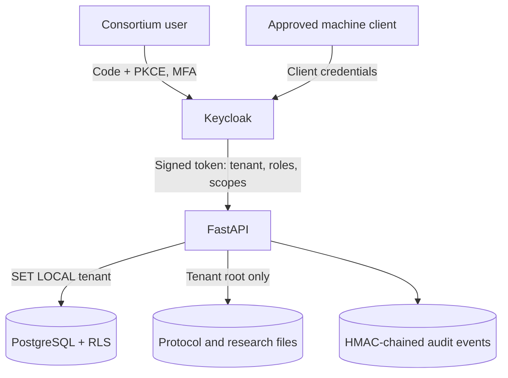

# Secure-foundation architecture

## Trust flow

## Decisions

- ADR-001: One realm with `organisation_id` as an immutable identity attribute. It avoids realm sprawl while preserving tenant boundaries in every token.
- ADR-002: PostgreSQL RLS is mandatory. Application filters improve clarity but are not the final tenant boundary.
- ADR-003: Legacy rows are quarantined, not guessed. `organisation_id` stays nullable only during the reviewed migration.
- ADR-004: Keycloak owns credentials. The app stores client ID and credential version only; a rotated secret is returned once.
- ADR-005: Audit events are append-only and chained per tenant. Export them to separate immutable storage for stronger non-repudiation.
- ADR-006: Production Swagger/OpenAPI UI is disabled. Publish reviewed versioned API documentation through the authenticated portal.

## Token requirements

FastAPI verifies signature, issuer, audience, expiry, issued-at time, authorised party and `organisation_id`. Missing or invalid claims fail closed. The tenant is never accepted from the request body, query string or a custom tenant header.

## Data ownership

Tenant-owned tables contain `organisation_id`. API sessions set `app.current_organisation_id` transaction-locally before queries. RLS uses this value for both reads and writes. The application database role must not own tables and must not have `BYPASSRLS`.
